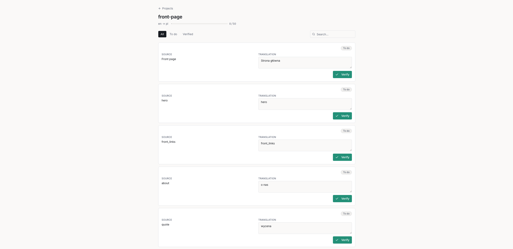

# WPML LLM Translator

Translate your WordPress (WPML) site with any LLM, then verify every line before re-importing.

## The Problem

WordPress multilingual sites powered by WPML need translations, but the options are limited:

- **Manual translation is slow** — professional translators are expensive and turnaround times are long.
- **WPML's built-in machine translation locks you in** — you're restricted to a handful of providers with no way to use modern LLMs.
- **No human review step** — machine translations go live without anyone checking them, leading to embarrassing mistakes.

WPML LLM Translator solves all three: pick any LLM via OpenRouter, translate in bulk, then review and approve every unit through a REST API before re-importing clean XLIFF files back into WPML.

## How It Works

```
XLIFF files ──► ingest ──► LLM translate ──► human verify (API/UI) ──► rebuild ──► re-import to WPML
```

1. Export XLIFF files from WPML and drop them into the inbox.
2. The **ingest** CLI parses them into translation units stored in Supabase.
3. The **translate** CLI sends each unit to your chosen LLM via OpenRouter.
4. A human reviews, edits, and verifies translations through the REST API (or a frontend).
5. The **rebuild** CLI reassembles verified translations into valid XLIFF files in the outbox.
6. Zip and re-import the outbox files into WPML — done.



## Features

- **Any LLM via OpenRouter** — Claude, GPT-4, Llama, Gemini, and dozens more
- **Any language pair** — translate between any languages your chosen model supports
- **HTML-aware splitting** — long content with markup is segmented so the LLM sees clean text, then reassembled with the original HTML structure intact
- **Human-in-the-loop verification** — every translation is reviewed before export; nothing ships unchecked
- **Safe XLIFF rebuild** — output files preserve the original XLIFF structure so WPML re-imports cleanly
- **Swagger API docs** — interactive docs at `/api-docs` for exploring and testing the API
- **Batch operations** — ingest and translate entire sites or individual projects

## Quick Start

```bash
# Install dependencies
npm install

# Configure environment
cp .env.example .env
# Fill in your Supabase and OpenRouter credentials in .env

# Start the API server (development)
npm run dev
```

## CLI Reference

| Command | Description | Example |
|---------|-------------|---------|
| `npm run ingest` | Parse XLIFF files into translation units | `npm run ingest -- --project front-page --source-lang en --target-lang pl` |
| `npm run translate` | Translate pending units with the configured LLM | `npm run translate -- --project front-page` |
| `npm run rebuild` | Rebuild verified translations into XLIFF files | `npm run rebuild -- --project front-page` |

Omit `--project` from `ingest` and `translate` to process all projects at once.

## API Endpoints

All endpoints require an `X-API-Key` header. Interactive docs are available at `/api-docs`.

| Method | Endpoint | Description |
|--------|----------|-------------|
| `GET` | `/api/projects` | List all projects with unit counts and verification progress |
| `GET` | `/api/projects/:id` | Get a single project with unit counts |
| `GET` | `/api/projects/:id/units` | List units (paginated, filterable by `status` and `search`) |
| `GET` | `/api/projects/:id/readiness` | Check if all units are verified and project is ready for rebuild |
| `GET` | `/api/units/:id` | Get a single translation unit |
| `PATCH` | `/api/units/:id` | Update `review_text` and/or `status` (`todo`, `in_review`, `verified`) |

## Workflow

1. Create a subdirectory per project in `translations/inbox/` and place `.xliff` files inside.
2. Run `npm run ingest` to parse files and create translation units in the database.
3. Run `npm run translate` to machine-translate pending units (code-only units are automatically skipped).
4. Review and verify translations through the API (`PATCH /api/units/:id`).
5. Check readiness: `GET /api/projects/:id/readiness`.
6. Run `npm run rebuild` to generate output XLIFF files.
7. Zip the project folder from `translations/outbox/` and import into WPML.

## Configuration

| Variable | Required | Default | Description |
|----------|----------|---------|-------------|
| `SUPABASE_URL` | Yes | — | Supabase project URL |
| `SUPABASE_SERVICE_ROLE_KEY` | Yes | — | Supabase service role key |
| `API_KEY` | Yes | — | API key for authenticating requests (`X-API-Key` header) |
| `OPENROUTER_API_KEY` | Yes | — | OpenRouter API key for LLM access |
| `OPENROUTER_MODEL` | No | `anthropic/claude-sonnet-4-6` | OpenRouter model identifier |
| `INBOX_DIR` | No | `./translations/inbox` | Directory for input XLIFF files |
| `OUTBOX_DIR` | No | `./translations/outbox` | Directory for rebuilt XLIFF files |
| `CORS_ORIGIN` | No | `*` | Allowed CORS origins |
| `PORT` | No | `3000` | API server port |

## Architecture

```
src/
├── api/                  # Express REST API
│   ├── server.ts         # Server setup, Swagger config
│   ├── middleware/        # Auth middleware (X-API-Key)
│   └── routes/           # Project and unit endpoints
├── cli/                  # CLI commands
│   ├── ingest.ts         # XLIFF → database
│   ├── translate.ts      # Database → LLM → database
│   └── rebuild.ts        # Database → XLIFF
└── lib/                  # Shared libraries
    ├── xliff-parser.ts   # XLIFF reading and unit extraction
    ├── xliff-writer.ts   # XLIFF reconstruction
    ├── html-splitter.ts  # HTML-aware text segmentation
    ├── openrouter.ts     # OpenRouter API client
    └── supabase.ts       # Database client

translations/
├── inbox/                # Input: XLIFF files organized by project
└── outbox/               # Output: rebuilt XLIFF files ready for WPML
```

**Stack:** TypeScript, Express 5, Supabase (PostgreSQL), OpenRouter, Node.js 20+

## License

MIT
